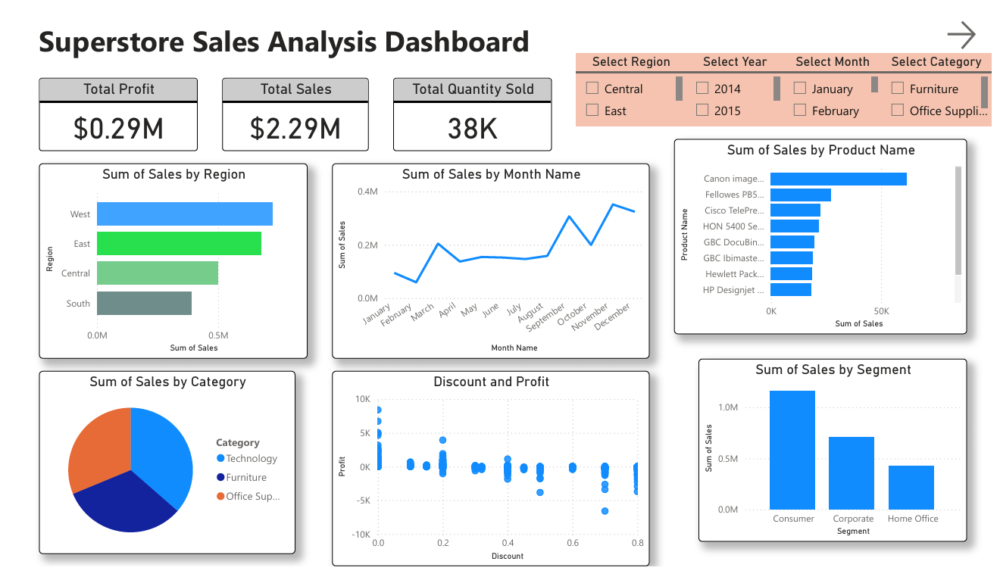
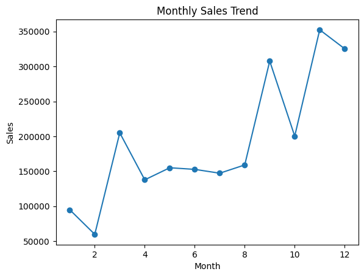
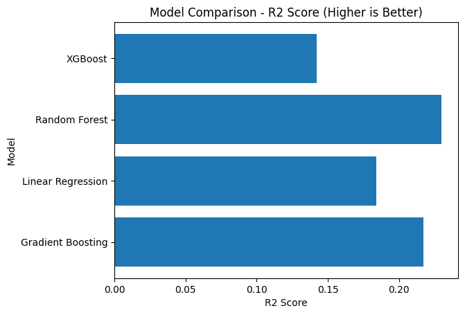
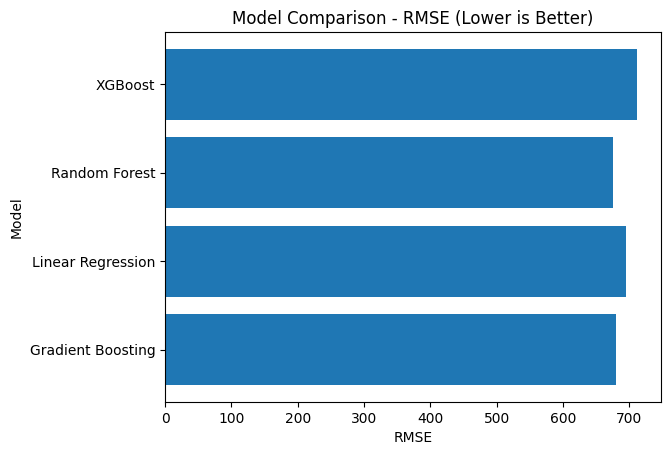

# Superstore Sales Analytics and Prediction System

## Overview
This project is an end-to-end retail sales analytics and prediction system developed using Python, MySQL, Power BI, and Machine Learning techniques. The project focuses on analyzing Superstore sales data, generating business insights, visualizing performance trends, and predicting future sales using multiple regression models.

The workflow includes:
- Data preprocessing using Python
- SQL-based business analysis
- Interactive Power BI dashboards
- Machine learning model implementation and evaluation

---

## Technologies Used
- Python
- Pandas
- NumPy
- Matplotlib
- Seaborn
- Scikit-learn
- XGBoost
- MySQL
- Power BI

---

## Dataset
The dataset used in this project is the Superstore dataset containing:
- Order details
- Customer information
- Product categories
- Regional sales data
- Profit and discount information
- Shipping details

---

## Project Workflow

### Data Preprocessing
- Handled missing values
- Removed duplicate records
- Converted date columns into datetime format
- Cleaned and transformed numerical columns
- Calculated shipping duration and additional metrics

### SQL Analysis
Performed SQL-based business analysis including:
- Top-selling products
- Region-wise sales analysis
- Monthly sales trends
- Customer segmentation
- Profitability analysis
- Loss-making transactions
- Window function analysis

### Power BI Dashboard
Created interactive dashboards to visualize:
- Total sales and profit
- Regional performance
- Category-wise revenue
- Monthly trends
- Customer insights
- Profit analysis

### Machine Learning Models
Implemented multiple regression models:
- Linear Regression
- Random Forest Regressor
- Gradient Boosting Regressor
- XGBoost Regressor

Model performance was evaluated using:
- RMSE
- R² Score

Random Forest achieved the best prediction accuracy.

---

## Dashboard Preview

## Sales Trend Analysis

## Model Comparison

---

## Key Insights
- Western region generated the highest revenue.
- Technology category produced higher profit margins compared to other categories.
- Several sub-categories generated high sales but low profitability due to discounts.
- Average shipping duration remained between 3–4 days.
- Random Forest outperformed other regression models in sales prediction.

---

## SQL Concepts Used
- GROUP BY
- ORDER BY
- HAVING
- Aggregate Functions
- Common Table Expressions (CTEs)
- Window Functions

---

## Future Improvements
- Deploy the prediction model using Flask or Streamlit
- Add real-time sales forecasting
- Integrate cloud database support
- Implement advanced time-series forecasting models

---

## Conclusion
This project demonstrates an end-to-end data analytics pipeline integrating Python, SQL, Power BI, and Machine Learning for retail business analysis and sales prediction.
